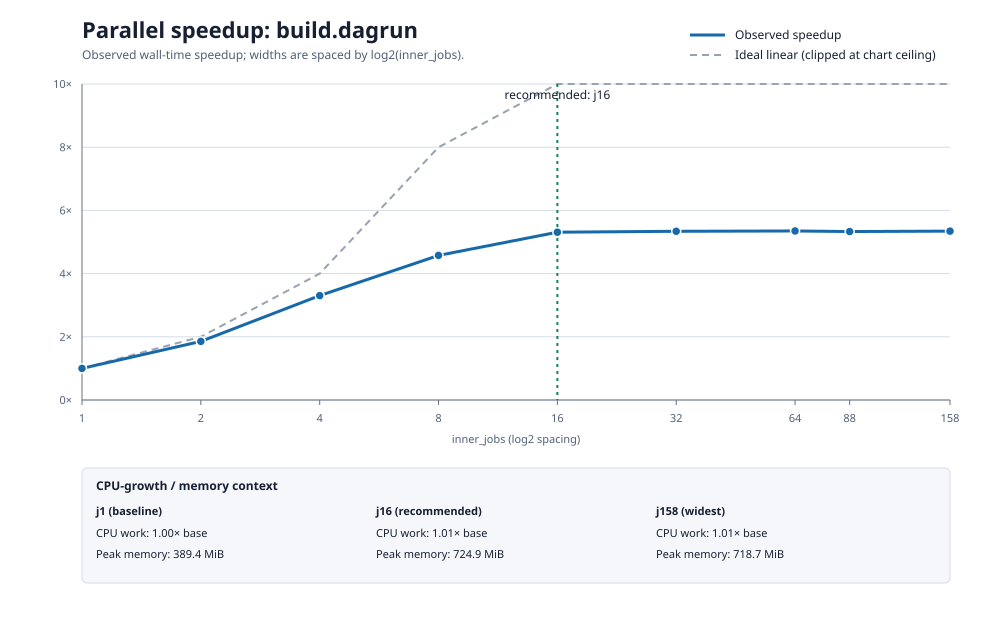
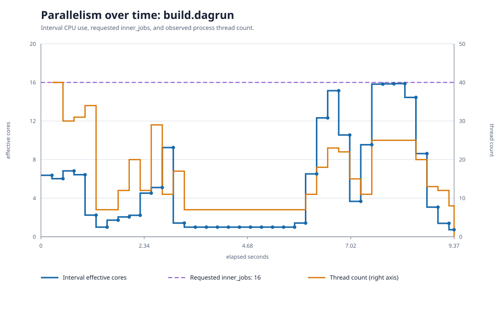
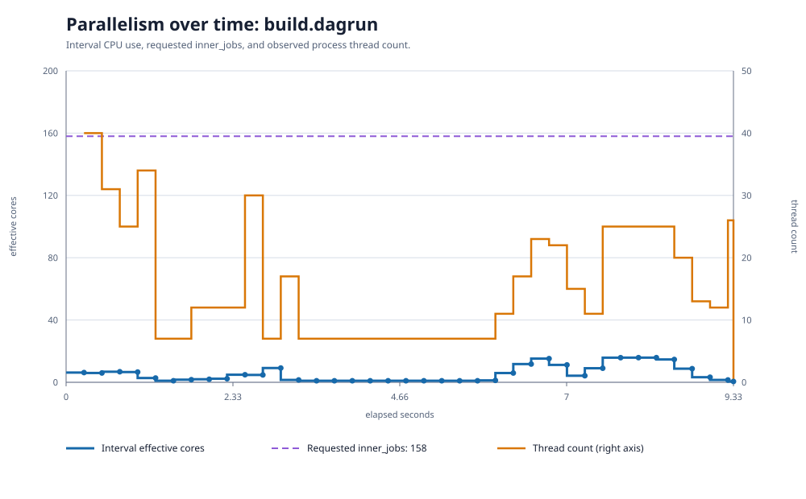

# Dagrun clean Cargo-build parallel-scaling sweep

Date: 2026-08-28

## Result

A clean release build of the `dagrun` binary reaches its useful plateau at **16 Cargo jobs** on
this host. The fitted wall-time speedup is 5.31x at `--jobs 16`; increasing the request to 64 jobs
improves that to only 5.35x (0.7% less wall time while reserving four times as many CPU slots).
Requests of 32, 64, 88, and 158 jobs are indistinguishable at the scale of this experiment.

The time series explains the plateau. In the representative 16-job run, the build averaged 5.33
effective cores and briefly reached 15.88, but spent 54.6% of its measured lifetime below four
effective cores and 41.3% below two. A roughly 2.5-second region in the middle stayed near one
core. The 158-job run had nearly the same shape: 5.36 average effective cores and 15.84 maximum.
Cargo can accept a much larger job limit, but this build does not expose enough simultaneous work
to use it.



## Artifacts

- [Speedup chart](assets/2026-08-28-dagrun-cargo-build-sweep/cargo-build-speedup.svg)
  and [plotted values](assets/2026-08-28-dagrun-cargo-build-sweep/cargo-build-speedup.csv)
- [Recommended-width j16 timeline](assets/2026-08-28-dagrun-cargo-build-sweep/cargo-build-parallelism-j16.svg)
  and [plotted values](assets/2026-08-28-dagrun-cargo-build-sweep/cargo-build-parallelism-j16.csv)
- [Overprovisioned j158 timeline](assets/2026-08-28-dagrun-cargo-build-sweep/cargo-build-parallelism-j158.svg)
  and [plotted values](assets/2026-08-28-dagrun-cargo-build-sweep/cargo-build-parallelism-j158.csv)
- [Raw aggregate profile rows](assets/2026-08-28-dagrun-cargo-build-sweep/raw-step-profiles.csv)
  and [derived scaling model](assets/2026-08-28-dagrun-cargo-build-sweep/scaling-model.json)
- Representative raw traces:
  [j16](assets/2026-08-28-dagrun-cargo-build-sweep/trace-j16-median.csv) and
  [j158](assets/2026-08-28-dagrun-cargo-build-sweep/trace-j158-median.csv)

The complete 27-trace working dataset remains on the measurement host at
`/tmp/dagrun-cargo-build-sweep.oOOOqVZc/profiles/`. The retained fresh Cargo target directories are
under `/tmp/dagrun-cargo-build-sweep.oOOOqVZc/targets/` and consumed about 1.5 GiB.

## Method

The measured source snapshot was commit `1bdc4e0f38149c807f27fe18fc00c4ada1725f4f`
(tree `33f5eaae6c4b3c42dfe57b68eb79d4d8fc3ec9fb`). The benchmark graph is
[`examples/08-dagrun-clean-build-sweep.yaml`](../examples/08-dagrun-clean-build-sweep.yaml).
Its `cargo-build` command type places `--jobs N` at the Cargo invocation and dagrun independently
limits the whole step cgroup to N cores.

Each of the 27 trials used a newly created, empty `CARGO_TARGET_DIR`. Incremental compilation was
disabled; Cargo ran `--release --locked --offline` for `x86_64-unknown-linux-gnu`; inherited
compiler-wrapper, target-dir, job-count, and Rust flags were removed. The Cargo registry/source
cache and operating-system page cache were deliberately warm, so this is a clean compilation
benchmark, not a cold download or cold-disk benchmark.

The command was:

```sh
DAGRUN_CARGO_SWEEP_ROOT=/tmp/dagrun-cargo-build-sweep.oOOOqVZc/targets \
  rs/target/x86_64-unknown-linux-gnu/release/dagrun sweep \
  --dag examples/08-dagrun-clean-build-sweep.yaml \
  --step build.dagrun \
  --target-time 0 \
  --repeat 3 \
  --profile-timeseries 250ms \
  --perf-dir /tmp/dagrun-cargo-build-sweep.oOOOqVZc/profiles
```

`--target-time 0` requests no optional refinement pass, but the mandatory first pass still runs to
completion. It tested `1, 2, 4, 8, 16, 32, 64, 88, 158`; the pass took 448.555 seconds and reported
the full 448.555-second target overrun, as required by the soft-budget policy.

The host was an AMD EPYC 9D64 with 88 physical cores and 176 hardware threads. Dagrun's outer
scope had a 15,840% CPU quota, yielding an effective 158-thread sweep ceiling. The CPU governor was
`performance`; the preflight load averages were 2.53, 3.14, and 3.39. Toolchain versions were
Cargo 1.94.1 and rustc 1.94.1 with GNU ld 2.35.2-72.el9. All trials were cgroup-v2 boxed, completed
successfully, and recorded no OOM or timeout censoring.

## Aggregate results

The table uses the model's robust, contention-adjusted wall estimate. `raw wall` is its robust raw
wall estimate, not the fastest value printed by the live sweep table. CPU growth is relative to
the one-job build; memory is the width-specific modeled peak.

| Cargo jobs | wall (s) | raw wall (s) | speedup | parallel efficiency | CPU (s) | CPU growth | peak memory |
|---:|---:|---:|---:|---:|---:|---:|---:|
| 1 | 49.332 | 49.774 | 1.000x | 100.0% | 49.212 | 1.000x | 389.4 MiB |
| 2 | 26.593 | 26.832 | 1.855x | 92.8% | 49.241 | 1.001x | 420.9 MiB |
| 4 | 14.931 | 15.074 | 3.304x | 82.6% | 49.465 | 1.005x | 473.5 MiB |
| 8 | 10.780 | 10.993 | 4.576x | 57.2% | 49.698 | 1.010x | 582.2 MiB |
| **16** | **9.291** | **9.358** | **5.310x** | **33.2%** | **49.853** | **1.013x** | **724.9 MiB** |
| 32 | 9.240 | 9.318 | 5.339x | 16.7% | 49.830 | 1.013x | 720.6 MiB |
| 64 | 9.223 | 9.308 | 5.349x | 8.4% | 49.984 | 1.016x | 720.1 MiB |
| 88 | 9.254 | 9.328 | 5.331x | 6.1% | 49.926 | 1.015x | 705.5 MiB |
| 158 | 9.231 | 9.329 | 5.344x | 3.4% | 49.946 | 1.015x | 718.7 MiB |

The model's plateau rule chooses the smallest measured width whose speedup is within 10% of the
best observed speedup, provided CPU work has grown by no more than 50%. That selects j16. It records
no regression width because the wider settings remain flat rather than becoming materially slower.

CPU work is essentially conserved: the widest build uses only 1.5% more CPU time than j1. The
tradeoff is therefore not wasted CPU work so much as idle reserved capacity. Memory rises with
useful parallelism, from 389 MiB at j1 to about 725 MiB at j16, and then also plateaus. A planner
should normally schedule this step at 16 cores and leave the remaining capacity for other ready
nodes; j8 may be preferable for throughput-sensitive graphs because it gives 4.58x speedup with
half the reservation.

## Within-step parallelism



The j16 trace shows several distinct phases rather than steady average utilization. The first
second uses roughly six to seven cores, a middle interval from approximately 3.25 to 5.75 seconds
is almost entirely single-core, and two later compile waves briefly use 12 to 16 cores. The final
three quarters of a second taper from about nine cores to less than one. Aggregate CPU/wall values
cannot expose this structure.



At j158, achieved parallelism still peaks around 16 cores and follows nearly the same phase shape.
The large gap between the requested-width line and measured effective cores makes the
over-allocation visible directly.

The new `--profile-timeseries DURATION` mode is opt-in because it writes many rows. It accepts 50ms
through 10s, requires active cgroup-v2 containment, and cannot be combined with `--no-profile`.
Each trace contains explicit `start`, absolute-deadline `periodic`, and pre-cleanup `final` samples
with cumulative CPU, interval effective/user/system cores, throttling, and descendant thread count.
Trace files are stored separately from aggregate profile rows and are not fed to the scaling model.

## Limitations

- Widths ran in ascending order, so cache warmth, thermal state, and time remain partially
  confounded even with three repeats.
- A one-node sweep guarantees that no sibling dagrun step overlaps the build, but it cannot exclude
  unrelated host activity. The recorded ambient-load fields permit inspection rather than making
  the host equivalent to a dedicated laboratory machine.
- Cargo `--jobs` controls Cargo's job slots, not every internal thread of rustc or the linker. The
  cgroup ceiling is the independent aggregate bound, and the trace reports what was actually used.
- This result describes this package graph, toolchain, target, and machine class. Source changes or
  dependency/toolchain changes should be measured as a new workload rather than blended into this
  curve.
