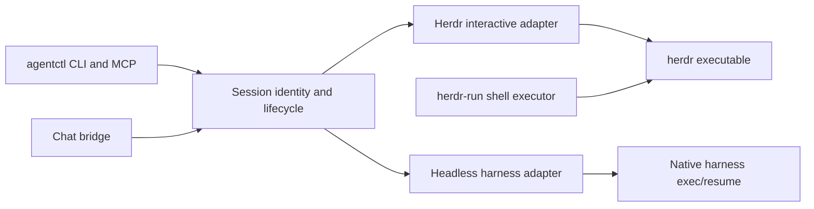

# agentctl: dependency separation and chat lifecycle review

Working analysis, 2026-09-17. This records current source behavior and proposed
boundaries before a package refactor. It is not a supported API specification.

## The agent layer does not use the shell executor

The answer to the package question is **no: a standalone agentctl does not need
to depend on the herdr-run shell-execution utility**. It needs session-control
code and the selected runtime adapter. The current Python imports are:

```text
agent_cli → subagents → agent → client → herdr executable
                      ↘ codex_goal
chat → agent + client
foreign worker runtime → agent + client for interactive delivery
```

The common support modules are errors, JSON validation, and package version
metadata. The agent queue also supplies private-state and atomic-write helpers
used by the managers and Chat. None of these paths imports the shell `runner`,
`allowlist`, YAML `config`, shell `session`, audit, readiness, or result-spool
implementation. Static import traversal was supplemented by reading the dynamic
foreign-command dispatcher and worker imports.

The corresponding Rust agent modules likewise use the Herdr client and error
types, plus their agent/goal modules. They do not call the shell runner. Both
implementations currently live in packages named `herdr-run`; that packaging
boundary is the source of the apparent dependency.

Source entry points:

- [agent_cli.py](../../../py/herdr_run/agent_cli.py)
- [agent.py](../../../py/herdr_run/agent.py)
- [subagents.py](../../../py/herdr_run/subagents.py)
- [client.py](../../../py/herdr_run/client.py)
- [foreign/lib.py](../../../py/herdr_run/foreign/lib.py)
- [Rust agent module](../../../rs/herdr-run/src/agent.rs)

## Proposed dependency direction



The Herdr adapter uses the public Herdr CLI, including agent prompt/state and
pane operations. Reimplementing the Herdr socket protocol is unnecessary. The
session-control core should not require Herdr when a different adapter is used.

Code that genuinely belongs to both tools can move to a small neutral client
library. Alternatively, an agent-specific adapter can own the small subset of
Herdr commands it needs. Neither choice requires the agent package to depend on
the shell-executor package. Avoid copying an entire client merely to preserve
an import path: its server bootstrap, broker policy, error vocabulary, and
shell-specific methods need separate ownership decisions.

The extraction must preserve queue formats, target locks, session identities,
and permission choices before changing default paths or aliases. Compatibility
shims must not create a circular package dependency. Python/Rust behavior checks
remain relevant for the existing paired interactive implementation; the Chat and
headless companions currently have only a Python implementation.

## Current Chat robustness: tested strengths

The existing [Chat tests](../../../py/tests/test_herdr_chat.py) exercise the real
durable delivery queue with fake harness/provider boundaries. They cover input
deduplication across bridge restart, stable reply request IDs after lost upstream
acknowledgement, suppression of the bridge's own messages, sender authorization,
busy-worker FIFO order, and stale-target refusal before external access.

They also cover accepting a keyed reply as execution evidence after a lost
working-state confirmation, rejecting replacement answers, and refusing unsafe
state-directory links. These are useful contracts to preserve; a successful
terminal paste alone would not provide them.

These tests do not establish production reliability across arbitrary providers,
native harness versions, or human/automated input races. The source comparison
and the local reproductions below are bounded evidence, not an overall quality
rating.

## Current Chat lifecycle limitations reproduced

Two local reproductions used the existing fake harness/provider fixtures and
temporary directories. They contacted no real Chat service and changed no live
agent state.

### A completed reply waits on the input target's liveness

Sequence: ingest a request, confirm delivery, write the final reply artifact,
then make the coordinator's target identity invalid before the next bridge tick.
The tick raises an identity failure before contacting Chat. The ready final
answer remains unsent.

This follows [Bridge.tick](../../../py/herdr_run/chat.py), which validates the
live target before reconciling the outbox. It is intentional conservative behavior
in the current contract, but it couples completed output to future input delivery.
The recorded reply can be valid even after the coordinator exits. A separated
endpoint design should decide how to flush already-authorized replies while
continuing to refuse new input to a stale target. That requires preserving the
request's original authority rather than bypassing identity checks globally.

### Reply-command idempotency ends at the replied phase

Sequence: submit an answer, let the bridge post it and mark the request `replied`,
then invoke the same reply command with the same key and text. It fails with
`request is not awaiting a reply`, although exactly one upstream reply exists.

[submit_reply](../../../py/herdr_run/chat.py) checks the request phase before
checking whether the identical reply artifact already exists. Identical retries
are accepted while the request awaits delivery, but not after completion. The
common reply API should return the already-completed result for an identical
retry and refuse conflicting content. Delivery remains deduplicated in the
current reproduction; the defect is the caller-visible retry outcome.

## Other explicit limits to account for

- A service restart does not restart or adopt the coordinator. Agent lifetime
  and bridge lifetime need distinct operations and status.
- The 60-second polling overlap handles brief indexing delays, not every late
  provider event. Longer outages/indexing delays need an explicit replay policy.
- A provider must honor the stable reply request ID; its finite retention window
  prevents an unlimited exactly-once claim.
- A native idle signal and a target lock do not establish that a human left the
  composer empty. Input ownership needs an explicit handoff contract.
- A request key correlates a final answer. Agent readiness, request completion,
  and overall goal completion remain separate facts.

See [current worker lifecycle review](CURRENT_LIFECYCLE_REVIEW.md) and
[public source lifecycle review](PUBLIC_LIFECYCLE_REVIEW.md) for the worker
failure cases and external comparisons. These observations should guide an
explicit failure-and-recovery contract before interfaces are consolidated.
