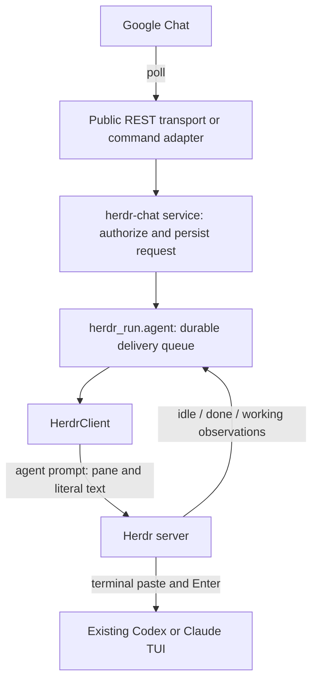
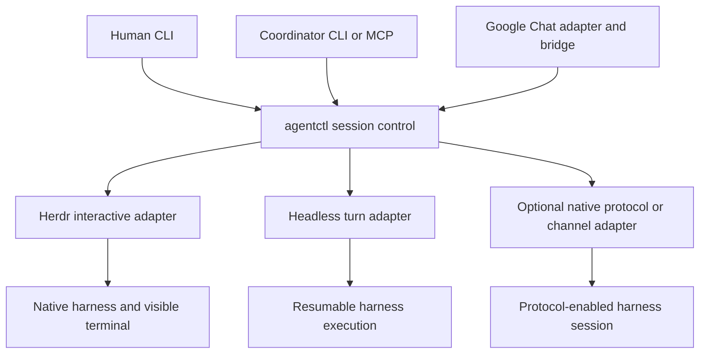

# agentctl: problem and component boundaries

Working draft, 2026-09-17.

This is a design discussion for consolidating existing utilities. Sections
labelled **current** describe implemented behavior. Sections labelled **proposed**
describe a target contract, not available commands or interchangeable backends.

## Problem

A coordinator needs to control coding-agent conversations that outlive a single
tool call. Each worker may use a different harness, keep its own context, and
require several exchanges before its task is complete. A human needs to inspect
and sometimes steer those same workers directly.

The common problem is reliable control of a persistent session from outside that
session: address the right conversation, submit input, observe progress, collect
the corresponding answer, and manage its lifetime. Both a coordinator delegating
work and a human messaging from a phone need this control path. Their policies
and user interfaces differ, but they should address the same session identity.

The lead agent owns task planning and delegation. The worker's native harness
owns model execution, tools, conversation context, and approvals. This utility
supplies session control around those harnesses. It does not need to become a
new reasoning loop, cloud scheduler, or model gateway to solve that problem.

## Current components and dependencies

All four commands are packaged in the Python `herdr-run` distribution. Packaging
does not imply that Chat invokes the shell runner, or that four daemons must run.

| Component | Owns | Runtime dependency and lifetime |
| --- | --- | --- |
| `herdr-run` | Shell-command admission, execution records, stdout/stderr and exit status | Short-lived CLI controlling a Herdr shell pane; independent of the chat path. |
| `herdr-agent` | Named interactive workers, launch identity, durable prompt queues, snapshots, optional native goals | CLI/library calls to Herdr; sends and waits can block. Herdr owns the live harness process after the command exits. |
| `herdr-subagents` | A second worker registry, headless turn runners, transcripts, migration, optional MCP server | Headless Codex/Antigravity on tmux or Herdr; interactive Codex on Herdr. A headless runner launches/resumes the harness per turn. |
| `herdr-chat` | Chat polling, sender authorization, request tracking, reply outbox and retries | A persistent bridge process plus an existing interactive coordinator in Herdr. It does not launch or restart that coordinator. |

The interactive branch of `herdr-subagents` and the chat bridge reuse the
`herdr_run.agent` delivery library. The two worker managers still have different
registries and lifecycle implementations. The native-goal operations belong to
`herdr-agent`; the current foreign-worker CLI/MCP does not expose them.

### Current chat input path

The exact submission primitive is `herdr agent prompt PANE TEXT`. Herdr performs
the harness-specific terminal input sequence. The bridge is not a Claude channel
plugin and does not submit chat input through a Codex protocol connection.

Before injection, the queue validates the pinned target and waits for Herdr's
`idle` or `done` state. It records the possibility of submission durably, invokes
the prompt primitive, and waits for `working`. A crash or missing acknowledgement
after injection leaves an uncertain delivery that is not automatically repeated.
Confirmed submission is not proof of a completed turn or task.

### Current chat reply path

The delivered prompt contains a request-specific reply command. The coordinator
writes a final UTF-8 answer and invokes `herdr-chat reply --request KEY --file
PATH` with the bridge state directory. This records a local reply artifact. The
bridge posts that answer into the original Google Chat thread with a stable
request ID for retry handling. It does not identify final answers by scraping the
terminal, and it does not mirror every thought, tool result, or terminal redraw.

The bridge and coordinator must share the reply-state filesystem and the reply
command. They are separate processes. Stopping the bridge leaves the agent alive;
stopping the agent leaves the bridge without a valid delivery target. A service
manager can restart the bridge, but that is not agent supervision.

### Can Chat be used alone today?

Yes, as a way to contact one existing coordinator with no worker team. The
`herdr-agent start` example is a convenience; an existing suitable Herdr pane can
be configured directly. No long-running `herdr-agent` command is required.

It still requires Herdr. `transport_command` replaces access to **Google Chat**,
such as authentication and polling through another Chat client. It does not
replace the **agent delivery** side. Current targets carry Herdr pane/session
assertions, and the bridge validates the target before its polling/reply cycle.
Headless workers, interactive tmux sessions, and standalone Codex protocol
endpoints are not current chat targets.

The supported description is: **message a dedicated Codex or Claude coordinator
running in Herdr from Google Chat, and receive its explicit final replies in the
originating thread.** Setup needs a working Herdr harness integration, an
authenticated harness, Google Chat read/write access, an explicit sender
allowlist, and a running bridge service. It is not a drop-in plugin for an
arbitrary existing terminal session.

Other present limits matter to that description: one configured space per bridge;
text messages and final replies; no cross-space trigger discovery or reaction
acknowledgement; no automatic coordinator restart. Some Claude integrations do
not report working transitions, so execution can remain uncertain until the
explicit reply artifact arrives. Human input must leave no unfinished draft in
the coordinator's composer before automated delivery.

## Proposed boundaries

Use one session-control model with separate adapters for the two ends:

The terminal host, execution mode, and harness are distinct properties of a
session. They are not a promise that every combination works. Herdr is the
existing interactive implementation; a tmux interactive implementation would
need harness identity, readiness, submission, and completion signals beyond
`send-keys`. A headless runner can already be displayed in tmux without using
keystrokes to submit each prompt.

### Session endpoint: the minimum Chat needs

A session endpoint should expose:

1. A stable session identity, ownership assertions, and supported capabilities.
2. Submission of a correlated request: ID, text, and a reply destination.
3. Distinct durable outcomes for pending, confirmed, and uncertain delivery,
   plus a way to reconcile a previously submitted request.
4. Correlated progress and final replies where supported. An adapter may obtain
   these from explicit reply artifacts or structured harness events.

Chat then depends on that endpoint, rather than on pane IDs or the worker
launcher. A user can bind a bridge to a session created elsewhere. Headless
execution can return its structured final answer through the same reply contract.
A native channel or protocol adapter can deliver input without terminal paste,
if the harness exposes the required supported interface.

This does not imply that a separate protocol process can take over any already
running TUI conversation. Session attachment, simultaneous clients, approvals,
and event ownership must be established for each harness adapter. The existing
native-goal reader is not already a general-purpose chat-input adapter.

### Manager: additional lifecycle and visibility capabilities

The manager adds creation, listing, inspection, stopping, resuming, terminal
attachment, and optional native-goal operations around those endpoints. It owns
one registry and identity model across interactive and headless workers.

Capabilities must preserve meaningful differences. A terminal snapshot is not a
durable final answer. A ready prompt is not proof that a goal finished. Sending
an objective as text is not verified native-goal state. Unsupported operations
should explain the missing capability instead of silently approximating it.

Direct human interaction is part of the requirement. Automated senders are
already serialized, but the current queue lock cannot see a human's unfinished
composer draft. The common interface needs an explicit pause/handoff/resume
contract for input ownership before claiming seamless concurrent terminal and
remote control.

The coordinator continues to choose directories, allocate isolated worktrees
when needed, and govern simultaneous file edits. Multi-host execution and hosted
session infrastructure are separate extensions, not requirements for the first
common session interface.

### Command and service boundaries

`herdr-run` remains a shell-execution utility. One `agentctl` interface would
expose worker control, with Chat and MCP as optional command groups. The Chat
poller and a headless worker runner still need independent process lifetimes.
One top-level command does not require one monolithic daemon.

Before selecting exact subcommands or moving packages, the shared identity,
submission, reply, capabilities, and human-handoff contracts need agreement.
Existing command aliases and registry migration must preserve live sessions and
queued work. A rename alone would leave the current duplication intact.

## Proposed CLI and documentation contract

The CLI is the primary operator documentation surface. `agentctl --help` should
explain the purpose and available operations; `agentctl COMMAND --help` should
explain that operation; `agentctl quickstart` should provide a short working
setup; and `agentctl userguide` should expose the complete operator guide.
These are proposed command forms, not commands implemented by this draft.

The guide text needs one maintained source and must be embedded in installed
artifacts so it works offline, outside a source checkout. Whether that source
should be Markdown, structured data, or another form remains open. A separate
static user manual is not required merely because source files exist. Working
designs remain under `ai_docs/transient/`; generated implementation/API reference
such as rustdoc is a separate documentation product.

- Top-level help starts with the problem solved and lists commands with a short
  purpose, followed by a small working example.
- Command help describes every argument, required inputs, defaults, units,
  applicable execution modes, and whether an operation waits or returns early.
- Session names use one consistent argument convention. Parser errors identify
  misplaced or inapplicable options rather than silently ignoring them.
- Inspection distinguishes process liveness, readiness, delivery, turn
  completion, and native-goal completion. Machine output and exit statuses keep
  these differences usable by a coordinator.
- Introductory docs explain interactive versus headless operation, process
  ownership, direct human access, prerequisites, and actual supported backends.
- Related work cites public open-source systems and records what to reuse,
  adapt, or leave to those systems. Existing alternatives must be assessed before
  treating the proposed common CLI as a reason to build another remote platform.

See [RELATED_WORK.md](RELATED_WORK.md) for the comparison that informs those
decisions. This document specifies the problem and boundaries; it does not
commit to a package move, transport implementation, or migration sequence.
